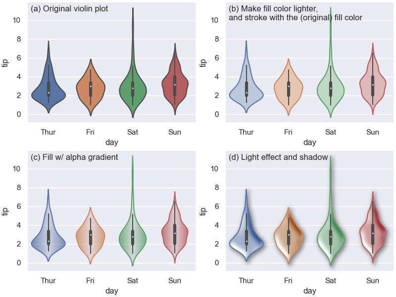

Welcome to mpl_visual_context's documentation!
===================================================================

A collection of tools that provide more visual context to your Matplotlib plots.:

Modules
=======

PathEffects
-----------

- Composable PathEffects : PatheEffects can be pipelined to create customize
  effects.

.. code-block:: python

    pe = [HLSModify(l=0.8) | FillOnly(),
          StrokeColorFromFillColor() | StrokeOnly()]
    a.set_path_effects(pe)

Check :doc:`userguide-patheffects` for more information.

ImageBox
~~~~~~~~

Installation
^^^^^^^^^^^^^

.. code-block:: bash

   pip install mpl_visual_context

Getting Help
^^^^^^^^^^^^

If you have a question on how to do something with ``mpl_visual_context`` a great place
to ask it is: https://discourse.matplotlib.org/c/3rdparty/18.

.. toctree::
   :maxdepth: 3

   examples/index
   API
   Contributing

Indices and tables
==================

* :ref:`genindex`
* :ref:`modindex`
* :ref:`search`
