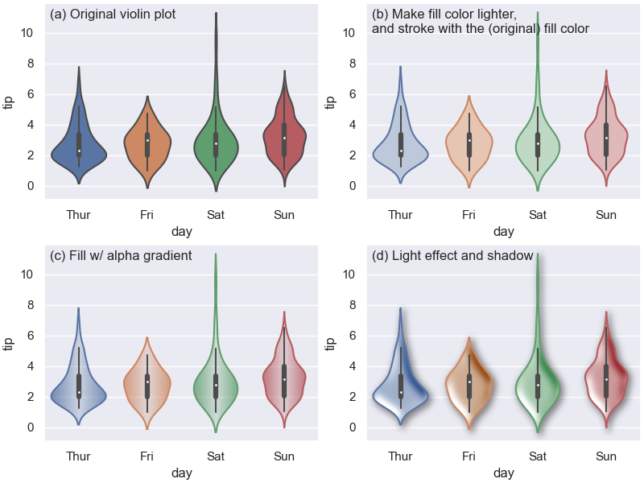

Welcome to mpl-visual-context's documentation!
==============================================

``mpl-visual-context`` is a Python library designed to extend Matplotlib's capabilities, enabling you to add richer visual context and sophisticated effects to your plots. If you've ever wanted to make your data storytelling more compelling, guide your audience's attention more effectively, or simply elevate the aesthetics of your visualizations, this library offers the tools to achieve those goals. We aim to provide intuitive and powerful extensions that integrate seamlessly with your existing Matplotlib workflow.

Key Features
------------
*   **Advanced PathEffects:** Go beyond Matplotlib's standard path effects with a suite of composable effects. Create custom pipelines for unique visual styles, including color modifications, path alterations, and stylistic additions like glow and multiple strokes.
*   **Image-Based Enhancements:** Integrate dynamic, image-based elements directly into your plots, such as gradient fills and the application of image processing filters to artists.
*   **Composable API:** Many features are designed with a composable API, allowing effects and components to be chained or combined, offering fine-grained control over the final appearance of your plot elements.
*   **Seamless Matplotlib Integration:** Built to work naturally with Matplotlib objects and conventions.

Getting Started
---------------

New to ``mpl-visual_context``? This section will help you get up and running.

Installation
~~~~~~~~~~~~
To install ``mpl-visual-context``, run the following command in your terminal:

.. code-block:: bash

   pip install mpl_visual_context

First Example: Adding a Glow
~~~~~~~~~~~~~~~~~~~~~~~~~~~~
Here's a quick example of how to apply a glow effect to a plotted line, a common task made easy with ``mpl-visual-context``:

.. plot::
   :include-source:
   :align: center

   import matplotlib.pyplot as plt
   from mpl_visual_context.patheffects import Glow
   from matplotlib.patheffects import Normal # For the original line

   # Sample data
   x = [0, 1, 2, 3, 4]
   y = [0, 2, 1, 3, 1]

   fig, ax = plt.subplots(figsize=(6, 4))
   line, = ax.plot(x, y, linewidth=2, label="My Data")

   # Apply a glow effect
   line.set_path_effects([Glow(alpha_line=0.8, n_glow_lines=10), Normal()])

   ax.set_title("Plot with Glow Effect")
   ax.legend()
   plt.show()

For more detailed information and guides, please see our :doc:`USERGUIDE`.

Core Components
---------------

``mpl-visual-context`` offers several key components to enhance your plots:

PathEffects
~~~~~~~~~~~
The :mod:`~mpl_visual_context.patheffects` module provides a rich collection of composable PathEffects that extend Matplotlib's native capabilities. These allow for intricate modifications to how artists are drawn, from color adjustments and path manipulations to complex stylistic renderings like glows and outlines.

See the :doc:`userguide-patheffects` for a detailed guide.

ImageBox
~~~~~~~~
The ImageBox component (details to be expanded - related to generating image-based textures like gradients used in effects such as ``AlphaGradient`` from the PathEffects module) allows for the creation and integration of image-based elements within your visualizations.
*(Further documentation for ImageBox will be added here as it's developed.)*

*(...other core components will be listed here as the documentation expands...)*

Table of Contents
-----------------

Explore the documentation using the links below:

.. toctree::
   :maxdepth: 2
   :caption: Documentation:

   USERGUIDE
   examples/index
   API
   Contributing

Indices and tables
==================

* :ref:`genindex`
* :ref:`modindex`
* :ref:`search`
